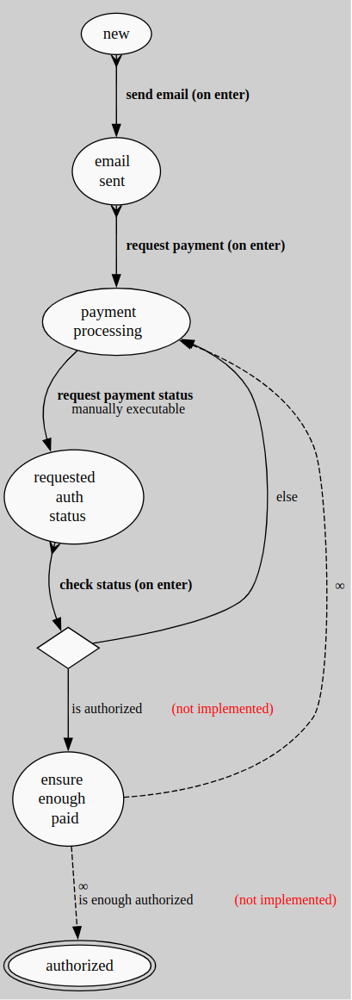

# Convert DrawIO diagram into OMS process

## Diagram rules and limitations
Please design a process in the DrawIO, following next set of rules:
1. Use regular or rounded rectangle to show a state, typing state name into it.
2. Use a diamond for a condition, typing the condition name into it.
3. Use any arrows as transitions, adding a label to name an event. Event types are not yet supported.
4. Only 2 transitions are allowed from the diamond, named YES/NO.
5. Adding on a 2nd line of the event name `on enter` or `onEnter` will recognise transition as `onEnter="true"`
6. Adding on a 2nd line of the event name `manual` will recognise transition as `manual="true"`

## Installation
1. Install the module: 
    ```bash
    composer config repositories.oms-convert-drawio vcs https://github.com/spryker-community/oms-convert-drawio
    composer require spryker-community/oms-convert-drawio
    ```
2. Include into `\Pyz\Zed\Console\ConsoleDependencyProvider::getConsoleCommands` instance of the following class `\Spryker\Zed\OmsConvertDrawIo\Communication\Console\ConvertConsole`. 
   I recommend adding this console as a development dependency.

## Convert process
1. Export your diagram into XML format.
2. Run command:
    ```bash
    console oms:convert:drawio <path to the XML file>
    ```
3. OMS process will be located near the XML with the suffix `-process.xml`
4. Move the process file into the correct location (usually `config/Zed/oms` ) and include process name into `config/Shared/common/config_oms-development.php` `$config[OmsConstants::ACTIVE_PROCESSES]`

## Example of conversion

From:


To:


